# Friday AI - Visual Architecture

> Complete system architecture with implementation status.
> Uses Mermaid diagrams (VS Code: `Markdown Preview Mermaid Support` extension).

**Last Updated**: February 7, 2026
**Branch**: iteration_5

---

## 1. High-Level System Overview

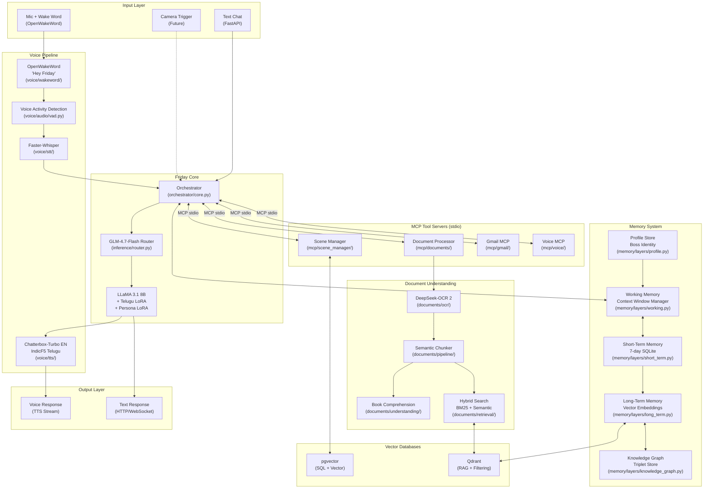

---

## 2. Agentic Routing Flow (Step-by-Step)

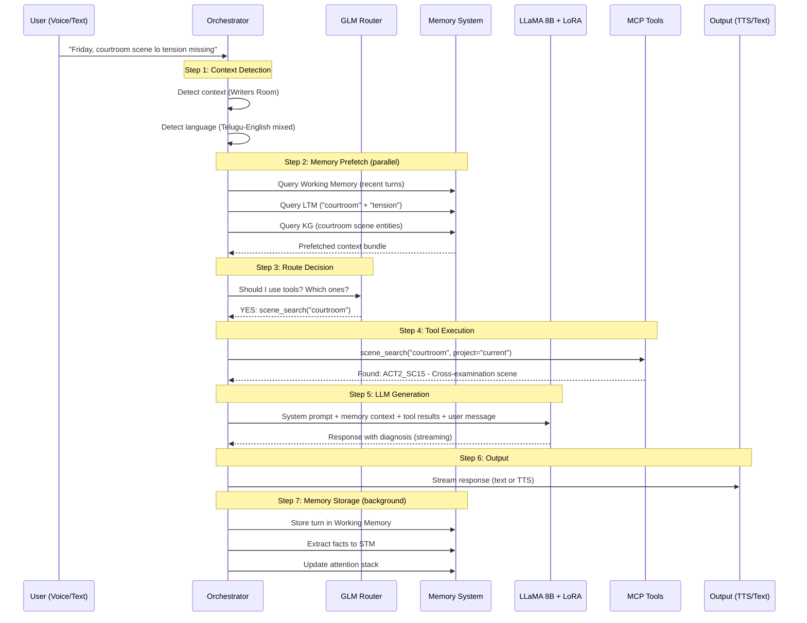

---

## 3. Memory Integration Architecture

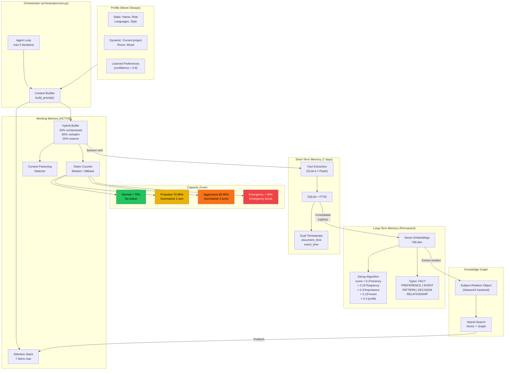

---

## 4. Document Processing Pipeline (DeepSeek OCR)

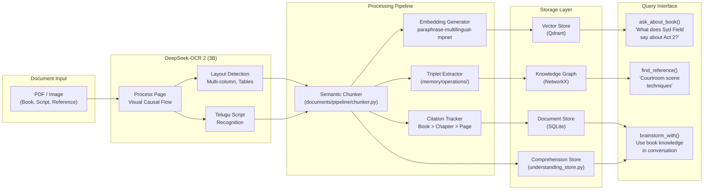

**This is CRITICAL for you**: Process screenwriting books, reference scripts, and research material so Friday can brainstorm with that knowledge.

---

## 5. Voice Pipeline Flow

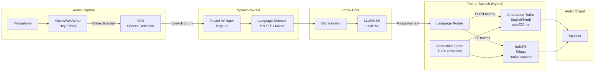

### Latency Target

```mermaid
gantt
    title Voice Response Timeline (Target < 800ms to first audio)
    dateFormat X
    axisFormat %Lms

    section Pipeline
    Wake Word Detection    :done, 0, 50
    VAD + Capture          :done, 50, 150
    STT (Whisper)          :active, 150, 350
    LLM Prefill            :active, 350, 500
    First Token Decode     : 500, 600
    TTS First Chunk        : 600, 800
    Audio Playback Starts  :milestone, 800, 800
```

---

## 6. Training Pipeline (Updated)

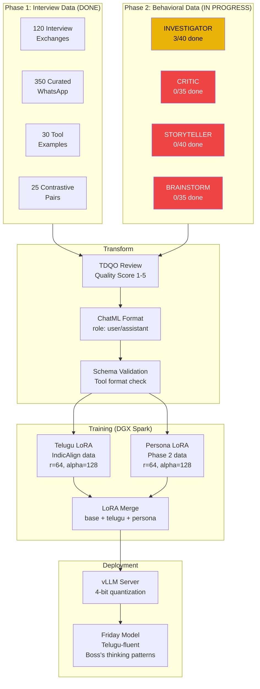

---

## 7. DGX Spark Deployment Layout

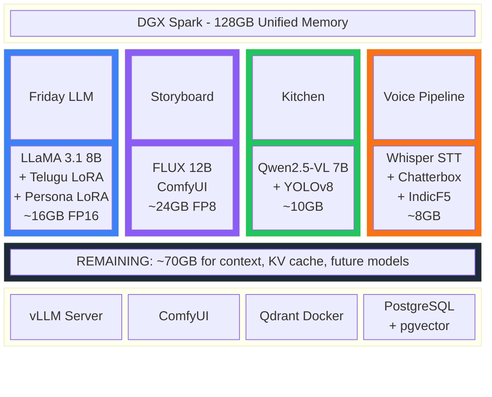

---

## 8. MCP Tool Routing Architecture

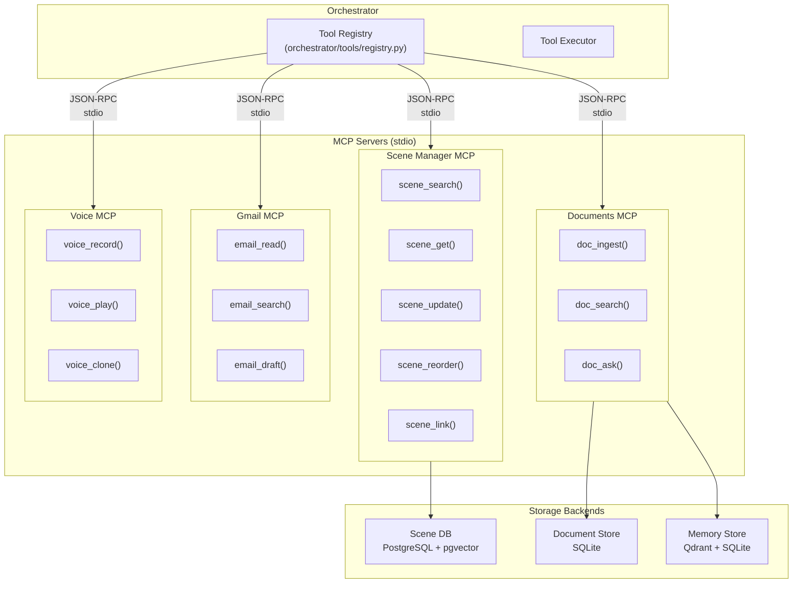

---

## 9. Component Implementation Status

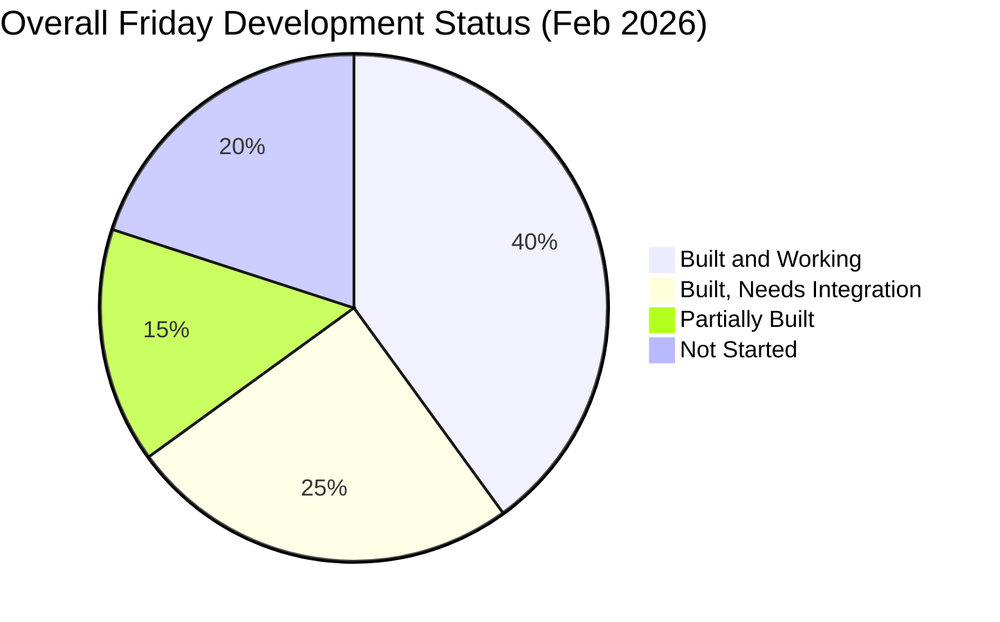

### Detailed Component Status

| Component | Status | % | Key File | Blocker |
|-----------|--------|---|----------|---------|
| **Orchestrator Core** | Built | 75% | `orchestrator/core.py` | Memory integration |
| **GLM Router** | Built | 90% | `orchestrator/inference/router.py` | Upskill enhancement |
| **Working Memory** | Built | 95% | `memory/layers/working.py` | LLM summarizer |
| **STM (7-day)** | Built | 90% | `memory/layers/short_term.py` | - |
| **LTM (Vector)** | Built | 90% | `memory/layers/long_term.py` | pgvector/Qdrant |
| **Knowledge Graph** | Built | 85% | `memory/layers/knowledge_graph.py` | Triplet extractor |
| **Profile Store** | Built | 80% | `memory/layers/profile.py` | - |
| **Scene Manager MCP** | Built | 95% | `mcp/scene_manager/` | - |
| **Gmail MCP** | Built | 60% | `mcp/gmail/` | OAuth testing |
| **Documents Module** | Partial | 70% | `documents/manager.py` | OCR testing |
| **DeepSeek OCR** | Structure | 30% | `documents/ocr/` | Not tested |
| **Book Comprehension** | Built | 70% | `documents/understanding/` | OCR + LTM link |
| **Voice Daemon** | Partial | 40% | `voice/daemon.py` | STT/TTS config |
| **Faster-Whisper STT** | Structure | 20% | `voice/stt/` | Not tested |
| **TTS (Chatterbox)** | Not started | 0% | `voice/tts/` | Replace XTTS |
| **Wake Word** | Structure | 20% | `voice/wakeword/` | Training samples |
| **Training Data (Phase 1)** | Done | 100% | `data/instructions/` | - |
| **Training Data (Phase 2)** | Started | 2% | `data/phase2/` | Boss playing Friday |
| **Model Training** | Not started | 0% | - | Phase 2 data + DGX |
| **Vector DB Setup** | Not started | 0% | - | Install pgvector/Qdrant |
| **Telugu LoRA** | Not started | 0% | - | IndicAlign download |
| **FastAPI Server** | Built | 90% | `orchestrator/main.py` | - |
| **Tests** | Minimal | 10% | `tests/` | Coverage expansion |

---

## 10. Critical Integration Map

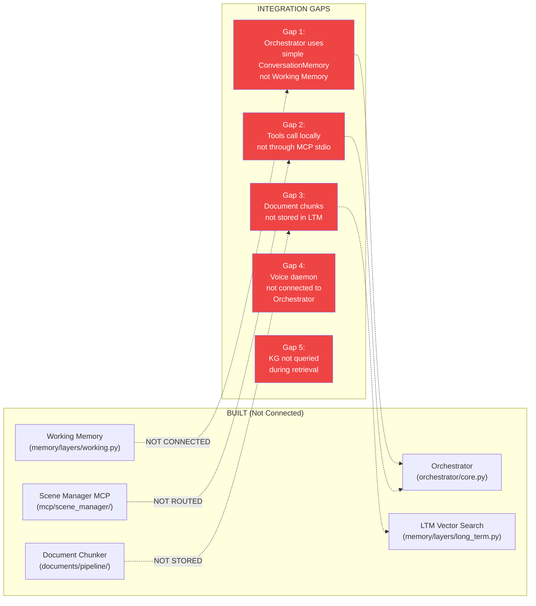

---

## 11. Future Extensibility (Storyboard + Kitchen)

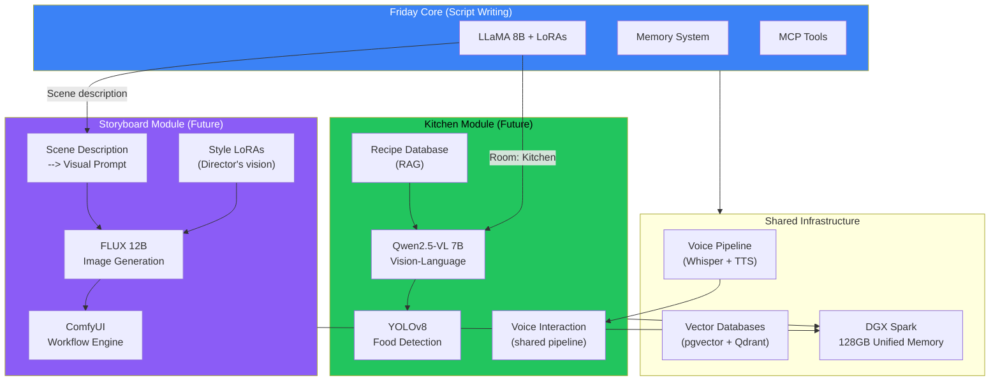

---

## 12. What to Build Next (Priority Order)

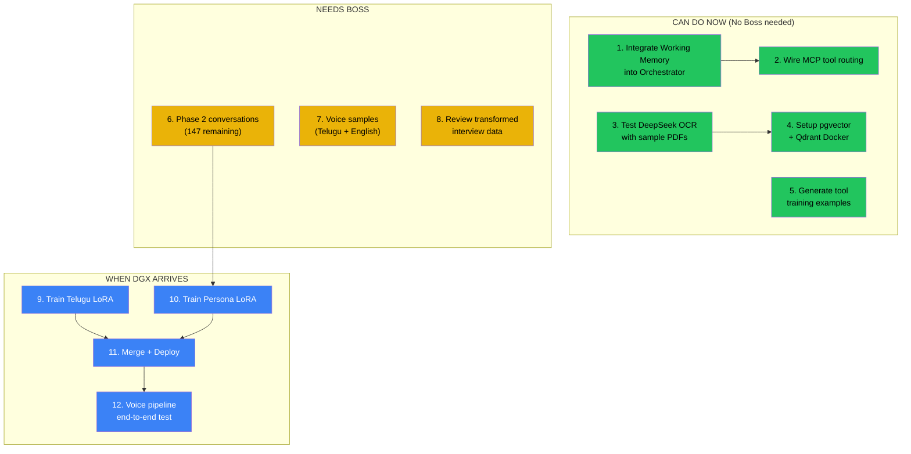

---

## Quick Reference: File Locations

| Component | Key Files |
|-----------|-----------|
| **Orchestrator** | `orchestrator/core.py`, `orchestrator/main.py` |
| **GLM Router** | `orchestrator/inference/router.py` |
| **LLM Client** | `orchestrator/inference/local_llm.py` |
| **Working Memory** | `memory/layers/working.py` |
| **Memory Manager** | `memory/manager.py` |
| **STM** | `memory/layers/short_term.py` |
| **LTM** | `memory/layers/long_term.py` |
| **Knowledge Graph** | `memory/layers/knowledge_graph.py` |
| **Profile** | `memory/layers/profile.py` |
| **Telugu Processor** | `memory/telugu/processor.py` |
| **Scene Manager** | `mcp/scene_manager/service.py` |
| **Documents** | `documents/manager.py` |
| **DeepSeek OCR** | `documents/ocr/deepseek_engine.py` |
| **Book Comprehension** | `documents/understanding/comprehension.py` |
| **Voice Daemon** | `voice/daemon.py` |
| **STT** | `voice/stt/faster_whisper_service.py` |
| **TTS** | `voice/tts/xtts_service.py` (to be replaced) |
| **Config** | `config/orchestrator_config.yaml` |
| **Training Data** | `data/phase2/behavioral_conversations/` |
| **Phase 2 Guide** | `prompts/phase2_data_generation_guide.md` |

---

## Research Documents Index

| Research | File | Key Finding |
|----------|------|-------------|
| **Telugu LoRA** | `docs/research/telugu_lora_adapter_stacking_research.md` | Doable, use IndicAlign + merge |
| **Vector Databases** | `docs/research/vector_databases_research.md` | pgvector + Qdrant dual approach |
| **Chatterbox TTS** | `docs/research/chatterbox_tts_research.md` | Replace XTTS v2, hybrid EN+TE |
| **DGX Spark** | `docs/research/dgx_spark_compatibility_research.md` | Suitable, all 4 models fit |
| **Memory Architecture** | `docs/architecture/FRIDAY_MEMORY_ARCHITECTURE.md` | Brain-inspired, 8 layers |
| **Context Window** | `docs/CONTEXT_WINDOW_MANAGEMENT.md` | 70% threshold, hybrid buffer |

---

## View This Document

1. Install `Markdown Preview Mermaid Support` extension in VS Code
2. Open this file and press `Cmd+Shift+V` for preview
3. Or use `Markdown Preview Enhanced` for side-by-side view

---

*"The architecture is the skeleton. Training data is the soul. Integration is the nervous system."*
